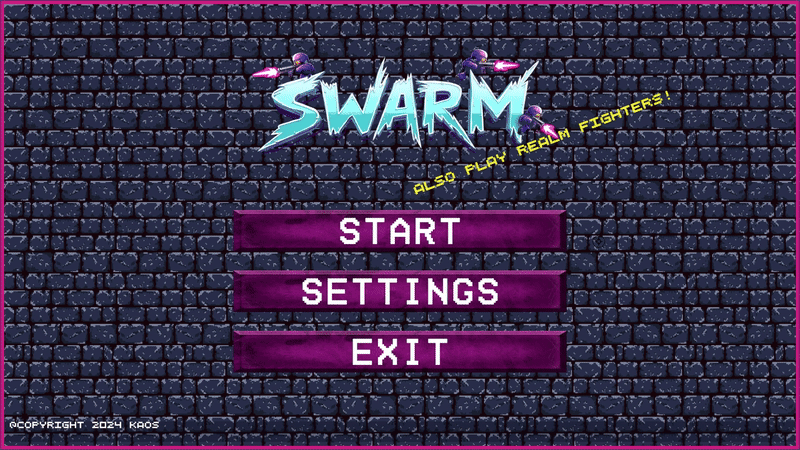
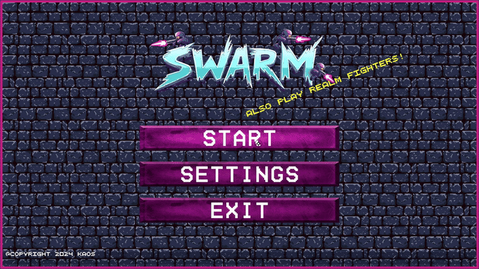
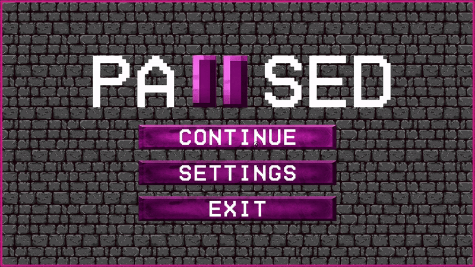

# Solo Game Redevelopment (Unity)

*SWARM* is a fast-paced, top-down 2D shooter game that was originally developed as a university team project. I fully redesigned and rebuilt the entire game on my own using Unity and C#, transforming it into a polished, user-focused, and technically stable product.

This redevelopment process emphasized improving the user experience, refining game balance, and applying consistent UI/UX principles based on iterative design and testing.

---

## 🏗 Project Architecture

### 🔁 Bootstrap Structure
To resolve inconsistencies such as resetting language and audio settings during scene transitions and malfunctioning restart functions, a BootstrapScene was created. In this scene, singleton systems like LocalizationManager and AudioManager were initialized, allowing all global settings to be managed centrally. As a result, the system remained stable and consistent regardless of the scene from which the player entered the game.

### ⏸ Global Pause System
A pause system usable across all scenes was developed. The pause menu was designed from scratch, made compatible with all UI elements, and optimized to function without disrupting the game flow.

---

## 🖼 UI/UX Redesign

### 🌐 Language & Font Compatibility
Fonts that caused readability issues in Turkish and English were identified and replaced with a commercially usable font suitable for both languages.

### 🎨 Interface Updates
- The main menu, character selection, level summary, and shop screens were redesigned from scratch.  
- Icons and buttons in pixel-art style were added.  
- Alignment, visual consistency, and user accessibility were improved across all UI components.

### 🧪 UX Testing
All menus, transitions, and UI interactions were manually tested. The level summary screen was simplified and redesigned to ensure better clarity and user focus.

---

## 🗺 Level & Content Development

### 🗂 Map Design
A total of 20 maps were redesigned from scratch. Level structures were diversified considering the difficulty curve.

### 📘 Gameplay Guidance
An animated tutorial message was added to the first level to explain core mechanics to new players.

### 🧍‍♂ NPCs & Enemies
Behavioral issues with existing NPCs were fixed, new enemy types were added, and all AI was optimized to function more consistently.

---

## ⚙ Game Mechanics & Balancing

### 🔫 Weapon & Character Adjustments
All weapon damage, range, and cost values were rebalanced. Ares and Nox characters were adjusted based on player feedback.

### 💰 Economy System
Rewards were updated to be calculated dynamically, based not only on level completion but also on remaining health and time. This system aims to reward player performance.

### 🧠 Skill & Summary System
At the end of each level, acquired skill effects were consolidated into a single percentage and displayed through a newly designed, clean summary UI.

---

## 🎥 Media & Animations

### 🎞 Intro Video
An intro video was added to the opening scene. Transitions and video playback were optimized for smooth operation.

### ✨ Map Animations
To enhance visual richness, custom environmental animations were produced and integrated into the game maps.

---

## 🧪 Testing & Stability

- All levels were manually tested to ensure error-free functionality.  
- Menu transitions, buttons, pause, retry, and start functions were corrected to work consistently across scenes.  
- Sound effects, especially weapon sounds, were restructured to work properly after scene changes.

---

## ✅ Acquired Skills

By developing this project entirely on my own, I gained the following technical and product-oriented skills:

- Identifying user needs and developing solution-oriented features  
- Making architectural design decisions to improve system stability  
- Designing a data-driven economy system for dynamic, non-repetitive gameplay based on performance  
- Planning progressive difficulty curves to balance gameplay experience  
- Simplifying UI to improve interaction and accessibility  
- Analyzing existing product infrastructure and resolving functional issues  
- Ensuring consistent and localized user experience in multilingual content  
- Integrating media and animation content into the user flow  
- Validating game system consistency and stability through manual testing  
- Independently managing the product development process from concept to implementation  

## GAMEPLAY

### Choose your agent!

### Dash to escape enemies with Shift!

### Face new and tougher enemies at every level!

### Take a breather!

### Because escaping is never that easy.

## 🛠 Requirements

This project was built using *Unity 2022.3.49f1 (LTS)*.  
To avoid compatibility issues, please make sure to open the project with this version or later within the 2022.3 LTS release cycle.

## 🚀 How to Run

1. Clone or download the repository.  
2. Open the project with *Unity 2022.3.49f1 (LTS)*  
3. Load the BootstrapScene to start the game in the correct state.  
4. Press Play and enjoy!

## Contact 💬

- *Email:* [erylmzbsr@gmail.com](mailto:erylmzbsr@gmail.com)  
- *GitHub:* [busraerylmaaz/SWARM_ImprovedVersion](https://github.com/busraerylmaaz/SWARM_ImprovedVersion)
- *Linkedln:* [www.linkedin.com/in/busraerylmaaz](www.linkedin.com/in/busraerylmaaz)
